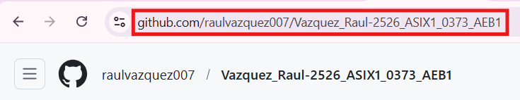
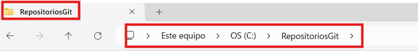
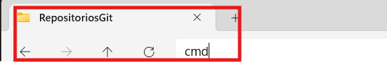
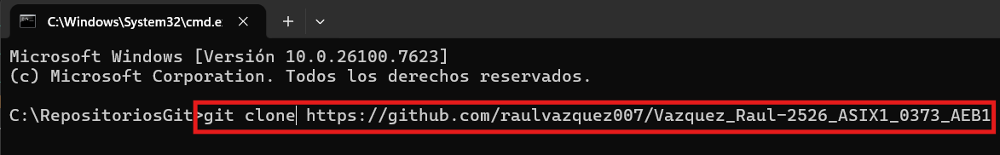
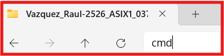
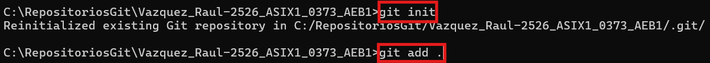
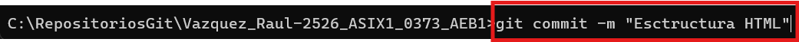
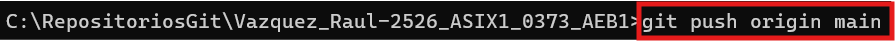
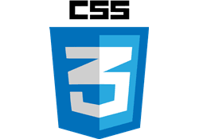
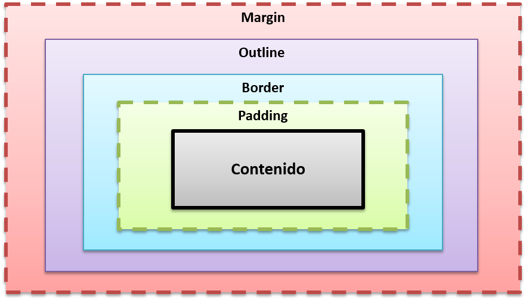

# AE1b Mi documentación (apuntes) [REVISIÓN 1] Raul Vazquez

## Etiquetas basica MarkDown
### **Encabezados:** 
Los encabezados vienen con un formato propio y sirven para dividir y organizar secciones dentro de un documento.
Cuantas más almohadillas uses (#), más pequeño será el título.
Por ejemplo, una sola # genera el título principal (H1), dos ## el siguiente nivel (H2), y así hasta seis.

Ej: 

# Hola
## hola
### hola
#### hola

### **Estilos de letra**

· **Negritas:** 
Para poner texto en negrita, se pueden usar dos guiones bajos(__) o dos asteriscos(**) antes y después del texto, sin espacios.

Ej:
Esto esta en __negrita__ 
Esto esta en **negrita** tambien

· _Cursiva_: Se puede poner el tenxto en cursiva utilizando 1 barra baja delante y 1 detras de la palabra o poniedo 1 asteriscos delante y 1 detras "_ algo _ o * algo *" sin seperacion!!

Ej:
Esto esta en _cursiva_
Esto esta en *cursiva*

### Enlaces

Para poner un enlace tenemos que utilizar esta estructura [] (), Dentro de los corchetes escribiremos el nombre del sitio y dentro de los parentesis pondremos el enlace y si quermeos escribir un texto adicional pondremos entre comillas el texto "Aqui dentro el texto".

Ej: 
[Periodico oficial del Pais](https://elpais.com/ "Texto adicional")

### Imagenes

Para poner una imagen usaremos la estructura ! []   (). Primero escribiremos ! junto a los corchetes es decir asi ! [] dentro del corchete escribirmeos alt tex, despues dentro de los parentesis pondremos la ruta donde esta la imagen  y si quermeos escribir un texto adicional pondremos entre comillas el texto "Aqui dentro el texto".

Ej:

### Tablas

Las tablas se crean usando la barra vertical | para separar columnas.
Se deben incluir tres guiones --- debajo de los encabezados para definirlos, y los dos puntos (:) se usan para alinear el texto (izquierda, centro o derecha).

| *Jugador* | Equipo | Nombre |
|:---------|:-------------:|:--------------|
| 32 | Lakers | Magic Johnson |
| 33 | Celtics| Boston Celtics |
| 23 | Bulls | Michael Jordan |

### Notas al pie de pagina:

Para poner un texto con pie de pagina utilizaremos los corchetes [] y dentro de los corchetes ^1.

Ej: Texto con enlace a nota de pie de pagina [^1]

## HTML

## Introducción a HTML

**HTML (HyperText Markup Language)** es el lenguaje estándar utilizado para crear páginas web.  
Es el lenguaje más importante de Internet, ya que sin HTML el navegador no podría mostrar ningún contenido.

HTML **define la estructura y el contenido** de una página web mediante etiquetas, como `<p>`, `<h1>`, `<body>`, etc.  
No se encarga del diseño visual (CSS) ni del comportamiento interactivo (JavaScript).

HTML **no es un lenguaje de programación**, ya que no tiene variables, bucles, condiciones ni funciones.

### Significado de HTML

- **HyperText**: texto que enlaza con otros recursos.
- **Markup**: el contenido se organiza mediante etiquetas.
- **Language**: tiene reglas y estructura propias.

---

## Elementos HTML

HTML está formado por **elementos**, que son los bloques básicos de una página web.

Un elemento HTML suele estar compuesto por:

1. **Etiqueta de apertura**  
   `<p>`
2. **Contenido**  
   Texto
3. **Etiqueta de cierre**  
   `</p>`

### Ejemplo
```html
<p>Hola mundo</p>
Atributos HTML
Los atributos añaden información adicional a los elementos.

Ejemplo
<p class="gato">Mi gato es muy gruñón</p>
class → nombre del atributo

gato → valor del atributo

Normas de los atributos
Siempre van en la etiqueta de apertura

Siguen el formato nombre="valor"

Deben ir entre comillas

Anidamiento y elementos vacíos
HTML permite anidar elementos, es decir, colocar unos dentro de otros.

Ejemplo correcto
<p><strong>Texto importante</strong></p>
Algunos elementos no tienen contenido ni etiqueta de cierre.
Se llaman elementos vacíos.

Ejemplo

Estructura básica de un documento HTML
Toda página HTML tiene una estructura básica:

<!DOCTYPE html>
<html>
  <head>
    <meta charset="utf-8">
    <title>Mi página web</title>
  </head>
  <body>
    <h1>Título principal</h1>
    <p>Contenido de la página</p>
  </body>
</html>
Elementos principales
<!DOCTYPE html>: indica el tipo de documento

<html>: elemento raíz

<head>: metadatos y enlaces externos

<body>: contenido visible

```html
Metadatos importantes en <head>
<meta charset="utf-8">
<meta name="viewport" content="width=device-width">
<meta name="description" content="Descripción del sitio">
<meta name="robots" content="index, follow">
 ```
# Elementos de bloque y de línea
## Elementos de bloque
Ocupan todo el ancho disponible y crean una nueva línea.

Ejemplos:
 ```html
<h1>, <p>, <div>, <ul>, <table>
   ```
 
## Elementos de línea
Solo ocupan el espacio necesario y no generan salto de línea.

__Ejemplos:__

 ```html
<em>, <strong>, <span>, <a>, 
 ```
### Normas básicas de HTML
 ```html
<p>Texto</p>
Algunas son vacías
, <br>, <input>
 ```

Deben anidarse correctamente

Los atributos van en la etiqueta de apertura

## Comentarios en HTML
Los comentarios no se muestran en el navegador.
 ```html
<!-- Comentario HTML -->
  ```
Se usan para explicar el código o separar secciones.

Legibilidad y organización del código

### Buenas prácticas:

1. Usar sangría correcta

2. Añadir comentarios claros

3. Organizar archivos en carpetas (css, images, js)

4. Mantener el código limpio y ordenado

# Etiquetas básicas de HTML
 ```html
Encabezados: <h1> a <h6>

Párrafos: <p>

Salto de línea: <br>

Separador: <hr>

Énfasis: <em>, <strong>

Contenedor en línea: <span>
 ```

# Listas en HTML 

## Lista desordenada 
 ```html
<ul>
  <li>Elemento 1</li>
  <li>Elemento 2</li>
</ul>
 ```
## Lista ordenada 
 ```html
<ol>
  <li>Elemento A</li>
  <li>Elemento B</li>
</ol>
 ```
## Listas anidadas
 ```html
<ul>
  <li>Lenguajes
    <ul>
      <li>HTML</li>
      <li>CSS</li>
    </ul>
  </li>
</ul>
```
# Rutas en HTML

## Ruta absoluta

```html

 ```
## Ruta relativa
 ```html

 ```
## Imágenes en HTML
 ```html

```
# Atributos
src

alt

width

height

# Enlaces HTML 
 ```html 
<a href="https://www.ejemplo.com" title="Ejemplo">Ir al sitio</a>
 ```
# Enlaces internos (anclas)
 ```html
<h2 id="contacto">Contacto</h2>
<a href="#contacto">Ir a contacto</a>
 ```
# Contenedores HTML 
 ```html
<div class="contenedor">
  <h2>Título</h2>
  <p>Texto</p>
</div>
```
Se usan para organizar contenido, aplicar estilos y manipular con JavaScript.

# Etiquetas semánticas HTML5
 ```
<header></header>
<nav></nav>
<main></main>
<section></section>
<article></article>
<footer></footer>
 ```
Mejoran la accesibilidad y el SEO.

# Formularios en HTML
 ```html
<form action="process.php" method="post">
  <label>Nombre:</label>
  <input type="text" name="nombre" required>

  <label>Email:</label>
  <input type="email" name="email">

  <label>
    <input type="checkbox"> Acepto condiciones
  </label>

  <button type="submit">Enviar</button>
</form>
 ```
 ## Resultado formulario
 <form action="process.php" method="post">
  <label>Nombre:</label>
  <input type="text" name="nombre" required>

  <label>Email:</label>
  <input type="email" name="email">

  <label>
    <input type="checkbox"> Acepto condiciones
  </label>

  <button type="submit">Enviar</button>
</form>

# Tablas en HTML
 ```html
<table border="1">
  <caption>Clasificación</caption>

  <thead>
    <tr>
      <th>Posición</th>
      <th>Nombre</th>
      <th>Puntos</th>
    </tr>
  </thead>

  <tbody>
    <tr>
      <td>1</td>
      <td>Ana</td>
      <td>98</td>
    </tr>
  </tbody>

  <tfoot>
    <tr>
      <td colspan="3">Resultados finales</td>
    </tr>
  </tfoot>
</table>
 ```
# Resultado Tabla
<table border="1">
  <caption>Clasificación</caption>

  <thead>
    <tr>
      <th>Posición</th>
      <th>Nombre</th>
      <th>Puntos</th>
    </tr>
  </thead>

  <tbody>
    <tr>
      <td>1</td>
      <td>Ana</td>
      <td>98</td>
    </tr>
  </tbody>

  <tfoot>
    <tr>
      <td colspan="3">Resultados finales</td>
    </tr>
  </tfoot>
</table>

# Resumen HTML
HTML define la estructura de una web

Usa etiquetas para organizar el contenido

No da estilo ni comportamiento

Es la base de cualquier página web


## GitHub

1. Primero en el buscador de nuestro navegador escribiremos GitHub
2. Una vez dentro iniciamos sesion con nuestra cuenta y si no tenemos nos registramos.
3. Despues clicams en el boton New que sale de color verde.
4. Ahi dentro escribirmeos el nombre del repositiorio y eligiremos si queremos que sea visible o privado.
5. No es necesario pero yo siempre activo la opcion del README.md
6. Una vez tengamos el repositorio hecho si queremos hacer el pages iremos a ajustes y luego a pages.
7. Una vez dentro nos aparece una seccion que dice Branch, donde dice None clicamos y cambiamos a main, clicamos en save y esperamos a que se genere el pages de nuestro repositorio.

## Git 

1. Para clonar un repositorio del GitHub con el git deberemos copiar el code que nos sale en la pantalla principal del repositorio dentro del GitHUb.

2. Una vez el codigo este copiado abriremos la carpeta donde tengamos todos los repositorios creados.

3. Una vez dentro arriba donde sale la ruta la eliminaremos y escribiremos cmd y clicaremos enter.

4. Despues en el cmd escribiremos git clone y el codigo del Repositorio.

5. Luego cerraremos ese cmd y entraremos en la carpeta del repositorio que se ha clonado con el comando anterior. En la ruta de arriba escribiremos cmd y enter.

6. Dentro del cmd escribiremos git init, despues git add .

7. Una vez hecho eso cuando queramos subir cambios que hemos realizado en el visual escribiremos git commit -m "texto informativo"

8. Y por ultimo escribiremos git push origin main y ya estaran subidos los cambios.


CSS



## ¿Qué es CSS?

CSS (**Cascading Style Sheets**) es el lenguaje que se utiliza para dar estilo a las páginas web.  
Mientras que HTML se encarga de la estructura y el contenido, CSS controla el diseño visual.

Con CSS podemos cambiar:

- Colores
- Tamaños de letra
- Márgenes y espacios
- Posición de los elementos
- Fondos y bordes

---

## ¿Cómo se aplica CSS?

Hay **tres formas** de aplicar CSS a un documento HTML.

---

### CSS en línea

Se escribe directamente dentro de una etiqueta HTML usando el atributo `style`.

```html
<p style="color: red;">Texto en rojo</p>
```

No es la forma más recomendable, pero sirve para pruebas rápidas.

---

### CSS interno

Se escribe dentro de la etiqueta `<style>` en el `<head>` del documento.

```html
<style>
  p {
    color: blue;
  }
</style>
```

---

### CSS externo (el más usado)

Se escribe en un archivo `.css` aparte y se enlaza desde HTML.

```html
<link rel="stylesheet" href="styles.css">
```

Esto permite tener el código más ordenado y fácil de mantener.

---

## Sintaxis básica de CSS

```css
selector {
  propiedad: valor;
}
```

### Ejemplo

```css
p {
  color: green;
  font-size: 16px;
}
```

---

## Selectores básicos

### Selector de etiqueta

Selecciona todas las etiquetas iguales.

```css
p {
  color: black;
}
```

### Selector de clase

Se usa con `.` y puede repetirse en varios elementos.

```css
.texto {
  color: blue;
}
```

### Selector de id

Se usa con `#` y es único.

```css
#titulo {
  font-size: 24px;
}
```

---

## Colores en CSS

Los colores se pueden definir de varias formas:

```css
color: red;
color: #ff0000;
color: rgb(255, 0, 0);
```

---

## Tipografía

```css
p {
  font-family: Arial, sans-serif;
  font-size: 18px;
  font-weight: bold;
}
```

---

## Modelo de caja (Box Model)

Todos los elementos HTML se comportan como una caja formada por:

- **Content**: el contenido
- **Padding**: espacio interno
- **Border**: borde
- **Margin**: espacio externo

### Ejemplo

```css
div {
  margin: 10px;
  padding: 15px;
  border: 2px solid black;
}
```


---

## Display

Define cómo se muestra un elemento en la página.

```css
display: block;
display: inline;
display: inline-block;
display: none;
```

---

## Posicionamiento básico

```css
position: static;
position: relative;
position: absolute;
position: fixed;
```

## Diseño Responsive

```css
@media (max-width:768px) {
  body {
    background: green;
  }
}
```

---

## Conclusión

HTML se encarga de la **estructura** y CSS del **diseño**.  
Usarlos juntos permite crear páginas web completas, ordenadas y visualmente atractivas.
